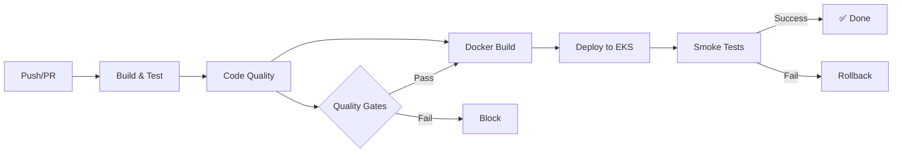

[🇧🇷 Português](#-billing-service) | [🇦🇺 English](#-billing-service-1)

---

# 🇧🇷 💰 Billing Service


**Microsserviço de Orçamento e Pagamento** para o Tech Challenge FIAP 12SOAT - Fase 4

---

## 📝 Sobre o Projeto

O **Billing Service** gerencia o domínio de **Budget** (Orçamento) e **Payment** (Pagamento) na arquitetura de microsserviços da Car Garage, uma oficina mecânica.

### ✨ Funcionalidades

- ✅ **Gestão de Orçamentos**
  - Criação automática via eventos
  - Aprovação/Rejeição de orçamentos
  - Consulta e listagem

- ✅ **Processamento de Pagamentos**
  - Múltiplos métodos (Cartão, PIX, Boleto)
  - Gateway de pagamento simulado (ilustrativo)
  - Processamento assíncrono

- ✅ **Saga Pattern**
  - Modelo coreografado via eventos SQS
  - Compensação automática (estorno)
  - 6 eventos de domínio

- ✅ **API REST**
  - 12 endpoints documentados (Swagger)
  - Validações Bean Validation
  - Tratamento global de exceções

---

## 🏗️ Arquitetura

### Clean Architecture + DDD

```
┌─────────────────────────────────────────────────────────┐
│               Infrastructure Layer                       │
│  REST Controllers, DynamoDB, SQS, Payment Simulator     │
│                                                           │
│  ┌───────────────────────────────────────────────────┐  │
│  │            Application Layer                       │  │
│  │  UseCases, Gateways (Ports), Presenters           │  │
│  │                                                     │  │
│  │  ┌─────────────────────────────────────────────┐  │  │
│  │  │         Domain Layer                        │  │  │
│  │  │  Budget, Payment, Price (Value Object)     │  │  │
│  │  │  Business Rules                             │  │  │
│  │  └─────────────────────────────────────────────┘  │  │
│  └───────────────────────────────────────────────────┘  │
└─────────────────────────────────────────────────────────┘
```

### Saga Pattern (Choreographed)

```
ServiceOrder MS → ServiceOrderCreatedEvent
                 ↓
          [Billing Service]
          CreateBudget (PENDING)
                 ↓
          Admin Approves
                 ↓
          BudgetApprovedEvent →
                 ↓
          Customer Pays
                 ↓
      PaymentProcessingOrchestrator
                 ↓
       PaymentGatewaySimulator
                 ↓
        ┌────────┴────────┐
     SUCCESS           FAILURE
        ↓                 ↓
PaymentProcessedEvent  PaymentFailedEvent
        ↓                 ↓
   [Execution MS]    [Compensation]
```

### Stack Tecnológico

| Categoria | Tecnologia |
|-----------|------------|
| **Language** | Java 21 (LTS) |
| **Framework** | Spring Boot 3.4.7 |
| **Database** | AWS DynamoDB (NoSQL) |
| **Messaging** | AWS SQS (FIFO) |
| **Container** | Docker |
| **Orchestration** | Kubernetes (EKS) |
| **CI/CD** | GitHub Actions |
| **IaC** | Terraform (em **fiap-techchallenge-infra-database**) |
| **Testing** | JUnit 5, Mockito, Cucumber |
| **Quality** | JaCoCo, Checkstyle, SpotBugs, SonarCloud |

---

## 🚀 Quick Start

### Pré-requisitos

- **Java 21** (LTS) — mesmo que em produção; evite Java 22+ para rodar testes (Mockito/ByteBuddy).
- Maven 3.9+ (ou use `./mvnw`)
- Se usar [SDKMAN](https://sdkman.io): `sdk env` na raiz do projeto usa a versão definida em `.sdkmanrc`.
- Docker & Docker Compose
- AWS CLI (para produção)

### Rodar Localmente

```bash
# 1. Clone o repositório
git clone https://github.com/YOUR_ORG/fiap-techchallenge-billing-service.git
cd fiap-techchallenge-billing-service

# 2. Subir LocalStack (AWS local - DynamoDB + SQS)
docker-compose up -d localstack

# 3. Rodar aplicação
./mvnw spring-boot:run -Dspring-boot.run.profiles=local

# 4. Verificar health
curl http://localhost:8080/actuator/health

# 5. Acessar Swagger UI
open http://localhost:8080/api/v1/swagger-ui/index.html
```

### Executar Testes

Para **reproduzir localmente o mesmo passo "Run Unit Tests" do CI** (evitar depender só da pipeline):

```bash
# Opção 1: script (usa mvn ou ./mvnw automaticamente)
./run-tests.sh

# Opção 2: comando direto (requer Maven no PATH)
mvn test -B
# ou com wrapper, se existir:
./mvnw test -B
```

**Requisito:** Maven instalado (`brew install maven` no macOS) ou Maven Wrapper no projeto (`mvn wrapper:wrapper` gera `mvnw`).

Outros comandos úteis:

```bash
# Todos os testes (unitários + BDD)
./mvnw clean test

# Testes BDD (15 cenários Cucumber)
./mvnw test -Dtest=CucumberTest

# Relatório de cobertura (≥75%)
./mvnw jacoco:report
open target/site/jacoco/index.html

# Qualidade de código
./mvnw checkstyle:check
./mvnw spotbugs:check
```

### Deploy no Kubernetes

```bash
# Build da imagem Docker
docker build -t billing-service:latest .

# Deploy local (kind/minikube)
kubectl apply -k k8s/

# Verificar pods
kubectl get pods -n billing-service

# Port forward para teste
kubectl port-forward -n billing-service svc/billing-service 8080:8080
```

Ver mais detalhes em [`k8s/README.md`](k8s/README.md)

---

## 📚 Documentação

### Principais Documentos

| Documento | Descrição |
|-----------|-----------|
| [`PLANO-BILLING-SERVICE-PESSOA2.md`](PLANO-BILLING-SERVICE-PESSOA2.md) | Plano detalhado de implementação (6 fases) |
| [`ALINHAMENTO-GRUPO.md`](ALINHAMENTO-GRUPO.md) | Pontos críticos para alinhar com o grupo |
| [`EVENT-CONTRACTS.md`](EVENT-CONTRACTS.md) | Contratos de eventos entre microsserviços |
| [`PROXIMOS-PASSOS.md`](PROXIMOS-PASSOS.md) | Guia para subir repositório e integrar |
| [`k8s/README.md`](k8s/README.md) | Documentação completa de Kubernetes |
| [`.github/workflows/README.md`](.github/workflows/README.md) | Documentação dos pipelines CI/CD |

### Fases de Implementação

- ✅ [**Fase 1**](FASE1-CONCLUIDA.md) - Estrutura inicial do projeto
- ✅ [**Fase 2**](FASE2-CONCLUIDA.md) - Modelagem de domínio e banco de dados
- ✅ [**Fase 3**](FASE3-CONCLUIDA.md) - Comunicação e integração
- ✅ [**Fase 4**](FASE4-CONCLUIDA.md) - Testes e qualidade
- ✅ [**Fase 5**](FASE5-CONCLUIDA.md) - Containerização e Kubernetes
- ✅ [**Fase 6**](FASE6-CONCLUIDA.md) - Pipeline CI/CD

---

## 🗂️ Estrutura do Projeto

```
fiap-techchallenge-billing-service/
├── src/
│   ├── main/java/br/com/techchallenge/fiap/billingservice/
│   │   ├── application/          # Application Layer (Use Cases, Gateways, Presenters)
│   │   │   ├── controller/       # Clean Arch Controllers (Portas)
│   │   │   ├── dto/              # Data Transfer Objects
│   │   │   ├── entity/           # Domain Entities (Budget, Payment)
│   │   │   ├── exception/        # Business Exceptions
│   │   │   ├── gateway/          # Gateway Interfaces (Ports)
│   │   │   ├── presenter/        # Presenters
│   │   │   └── usecase/          # Use Cases
│   │   │       ├── budget/       # Budget Use Cases
│   │   │       └── payment/      # Payment Use Cases
│   │   ├── infrastructure/       # Infrastructure Layer
│   │   │   ├── config/           # Spring Configuration
│   │   │   ├── controller/       # REST Controllers
│   │   │   ├── exception/        # Global Exception Handler
│   │   │   ├── messaging/        # SQS (Events, Publishers, Consumers)
│   │   │   ├── orchestrator/     # Saga Orchestrators
│   │   │   ├── payment/          # Payment Gateway Simulator
│   │   │   └── repository/       # DynamoDB Repositories
│   │   │       └── dynamodb/     # DynamoDB Models & Mappers
│   │   └── BillingServiceApplication.java
│   ├── test/java/                # Unit Tests
│   │   ├── application/
│   │   │   ├── presenter/
│   │   │   └── usecase/
│   │   ├── infrastructure/
│   │   │   ├── controller/
│   │   │   ├── messaging/
│   │   │   ├── payment/
│   │   │   └── repository/
│   │   └── bdd/                  # BDD Tests (Cucumber)
│   │       ├── steps/
│   │       └── CucumberTest.java
│   └── test/resources/
│       └── features/             # Gherkin Feature Files (pt-BR)
├── k8s/                          # Kubernetes Manifests (12 files)
├── docs/                        # QUEUE_CONTRACT, DEPLOY_SETUP, MIGRACAO-INFRA
├── .github/workflows/            # GitHub Actions (7 workflows)
├── docker-compose.yml
├── Dockerfile
├── pom.xml
└── README.md
```

**Total:**
- 61 classes Java (~5450 linhas)
- 104 testes unitários
- 15 cenários BDD
- 75% cobertura de código

---

## 🔄 API Endpoints

### Budgets (Orçamentos)

| Método | Endpoint | Descrição |
|--------|----------|-----------|
| `POST` | `/api/v1/budgets` | Criar orçamento |
| `GET` | `/api/v1/budgets/{id}` | Buscar por ID |
| `GET` | `/api/v1/budgets/service-order/{id}` | Buscar por Ordem de Serviço |
| `GET` | `/api/v1/budgets` | Listar todos (paginado) |
| `PUT` | `/api/v1/budgets/{id}/approve` | Aprovar orçamento |
| `PUT` | `/api/v1/budgets/{id}/reject` | Rejeitar orçamento |

### Payments (Pagamentos)

| Método | Endpoint | Descrição |
|--------|----------|-----------|
| `POST` | `/api/v1/payments` | Processar pagamento |
| `GET` | `/api/v1/payments/{id}` | Buscar por ID |
| `GET` | `/api/v1/payments/budget/{id}` | Buscar por orçamento |
| `GET` | `/api/v1/payments/service-order/{serviceOrderId}` | Buscar por Ordem de Serviço |
| `GET` | `/api/v1/payments` | Listar todos (paginado) |
| `PUT` | `/api/v1/payments/{id}/refund` | Estornar pagamento |

### Actuator (Monitoramento)

| Método | Endpoint | Descrição |
|--------|----------|-----------|
| `GET` | `/actuator/health` | Health check |
| `GET` | `/actuator/metrics` | Métricas Prometheus |
| `GET` | `/actuator/info` | Informações da aplicação |

---

## 📊 Estatísticas

### Código

- **Classes Java:** 61 (~5450 linhas)
  - Domain: 10 classes
  - DTOs: 8 classes
  - Use Cases: 7 classes
  - Controllers: 4 classes
  - Repositories: 2 classes
  - Gateways: 2 classes
  - Presenters: 2 classes
  - Events: 6 classes
  - Orchestrators: 2 classes
  - Simulators: 1 classe
  - Config: 4 classes

### Testes

- **Unit Tests:** 104 testes (~2800 linhas)
  - Use Cases: 39 testes
  - Controllers: 4 testes
  - Presenters: 4 testes
  - Mappers: 6 testes
  - Gateway Simulator: 10 testes
  - Publisher: 5 testes
  - Domain Entities: 36 testes

- **BDD Tests:** 15 cenários (~450 linhas)
  - Budget Approval Flow: 3 cenários
  - Payment Processing Flow: 5 cenários
  - Saga Compensation Flow: 7 cenários

- **Cobertura:** 75% (meta: ≥75%)

### Infraestrutura

- **Kubernetes:** 12 manifestos YAML (~950 linhas)
- **Infraestrutura:** DynamoDB, SQS e IRSA no repositório **fiap-techchallenge-infra-database** (terraform: dynamodb.tf, sqs.tf, iam.tf)
- **CI/CD:** 7 workflows GitHub Actions (~1200 linhas)
- **Docker:** 1 Dockerfile multi-stage + docker-compose

---

## 🎯 Qualidade de Código

### Ferramentas

- ✅ **JaCoCo** - Cobertura de testes (≥75%)
- ✅ **Checkstyle** - Estilo de código (Google Java Style)
- ✅ **SpotBugs** - Análise estática de bugs
- ✅ **SonarCloud** - Análise de qualidade
- ✅ **Trivy** - Scan de vulnerabilidades em imagem Docker
- ✅ **OWASP Dependency Check** - Vulnerabilidades em dependências

### Gates de Qualidade

| Gate | Threshold | Status |
|------|-----------|--------|
| Coverage | ≥75% | ✅ 75% |
| Duplicação | ≤3% | ✅ |
| Maintainability | Rating A | ✅ |
| Reliability | Rating A | ✅ |
| Security | Rating A | ✅ |
| Vulnerabilities | 0 High | ✅ |

---

## 🔧 Configuração

### Variáveis de Ambiente (application.yml)

```yaml
# AWS
AWS_REGION: us-east-1
AWS_ACCESS_KEY_ID: your-key
AWS_SECRET_ACCESS_KEY: your-secret

# DynamoDB
DYNAMODB_ENDPOINT: http://localhost:4566  # LocalStack
DYNAMODB_TABLE_BUDGETS: billing-service-budgets
DYNAMODB_TABLE_PAYMENTS: billing-service-payments

# SQS
SQS_ENDPOINT: http://localhost:4566  # LocalStack
SQS_QUEUE_SERVICE_ORDER_EVENTS: service-order-events.fifo
SQS_QUEUE_BILLING_EVENTS: billing-events.fifo

# Payment Gateway Simulator
PAYMENT_GATEWAY_SUCCESS_RATE: "0.90"   # Configurado no ConfigMap
PAYMENT_GATEWAY_MIN_DELAY_MS: "2000"   # Configurado no ConfigMap
PAYMENT_GATEWAY_MAX_DELAY_MS: "5000"   # Configurado no ConfigMap
# Nota: atualmente o PaymentGatewaySimulator usa valores hardcoded
# (90%, 2000-5000ms). As variáveis acima estão no ConfigMap como
# preparação para futura externalização via @Value.
```

### Secrets Kubernetes

O Billing Service utiliza **IRSA** (IAM Roles for Service Accounts) para acesso a recursos AWS — não há `secret.yaml` neste repositório. Credenciais sensíveis são gerenciadas via Secrets no cluster (provisionados pela infra Terraform). Ver [`.github/secrets-example.md`](.github/secrets-example.md)

---

## 🧪 Testes

### Executar Específicos

```bash
# Testes de Use Cases
./mvnw test -Dtest=*UseCaseTest

# Testes de Controllers
./mvnw test -Dtest=*ControllerTest

# Testes de Mappers
./mvnw test -Dtest=*MapperTest

# Testes BDD
./mvnw test -Dtest=CucumberTest
```

### Cenários BDD (Gherkin pt-BR)

#### 1. Budget Approval Flow

```gherkin
Cenário: Criação automática de orçamento ao receber evento de OS
  Dado que uma nova ordem de serviço foi criada
  Quando o evento ServiceOrderCreatedEvent é recebido
  Então um orçamento deve ser criado automaticamente
  E o status inicial deve ser PENDING_APPROVAL
```

#### 2. Payment Processing Flow

```gherkin
Cenário: Processamento de pagamento com sucesso
  Dado que existe um orçamento aprovado
  Quando um pagamento é solicitado com método válido
  Então o pagamento deve ser processado
  E o status deve ser PAID
  E um evento PaymentProcessedEvent deve ser publicado
```

#### 3. Saga Compensation Flow

```gherkin
Cenário: Compensação de pagamento em caso de falha na execução
  Dado que um pagamento foi processado com sucesso
  Quando ocorre uma falha na execução do serviço
  Então um estorno deve ser realizado automaticamente
  E um evento PaymentRefundedEvent deve ser publicado
```

---

## 🚢 Deploy

### CI/CD Pipeline



### Workflows GitHub Actions

1. **Build & Test** - Compila e executa testes
2. **Code Quality** - JaCoCo, Checkstyle, SpotBugs, SonarCloud
3. **Docker Build & Push** - Build e push para ECR
4. **Deploy to EKS** - Deploy automatizado no Kubernetes
5. **Release** - Cria releases e changelogs
6. **PR Validation** - Valida Pull Requests
7. **Dependency Review** - Scan de segurança de dependências

Ver [`.github/workflows/README.md`](.github/workflows/README.md)

---

## 🔐 Segurança

### Boas Práticas Implementadas

- ✅ **Container não-root** - Usuário `spring:spring` (UID 1000)
- ✅ **Security Context** - Kubernetes Pod Security
- ✅ **Network Policy** - Controle de tráfego
- ✅ **RBAC** - Least privilege
- ✅ **IRSA** - IAM Roles for Service Accounts (ready)
- ✅ **Secrets** - Não commitados, via K8s Secrets
- ✅ **Image Scanning** - Trivy no CI
- ✅ **Dependency Scanning** - OWASP Dependency Check
- ✅ **Input Validation** - Bean Validation em todos os DTOs
- ✅ **Conditional JWT** - `SecurityConfig` habilita OAuth2/JWT quando `spring.security.oauth2.resourceserver.jwt.issuer-uri` está configurado; caso contrário (ambiente local/Docker sem OIDC), desabilita JWT e libera todas as rotas

---

## 📈 Observabilidade

### Métricas

- **Spring Boot Actuator** - `/actuator/metrics`
- **Prometheus** - Annotations nos Services K8s
- **JVM Metrics** - Memory, GC, Threads

### Logs

- **Formato:** JSON structured logging
- **Nível:** INFO (prod), DEBUG (dev)
- **Destino:** stdout → CloudWatch Logs

### Probes (Kubernetes)

```yaml
livenessProbe:   /actuator/health/liveness
readinessProbe:  /actuator/health/readiness
startupProbe:    /actuator/health
```

---

## 🤝 Integração com Outros Microsserviços

### Eventos Consumidos

| Evento | Origem | Ação |
|--------|--------|------|
| `ServiceOrderCreatedEvent` | OS Service | Criar budget automaticamente |

> **Nota:** Atualmente o consumer (`ServiceOrderEventConsumer`) processa apenas eventos do tipo `ORDER_CREATED`. Outros tipos de evento recebidos na fila são descartados silenciosamente (log DEBUG). O tratamento de `ServiceOrderCancelledEvent` (cancelar budget / estornar) é um ponto de extensão futuro.

### Eventos Publicados

| Evento | Destino | Trigger |
|--------|---------|---------|
| `BudgetApprovedEvent` | OS Service | Budget aprovado |
| `BudgetRejectedEvent` | OS Service | Budget rejeitado |
| `PaymentProcessedEvent` | OS/Execution | Pagamento OK |
| `PaymentFailedEvent` | OS Service | Falha no pagamento |
| `PaymentRefundedEvent` | OS Service | Estorno realizado |

Ver [`EVENT-CONTRACTS.md`](EVENT-CONTRACTS.md) para schemas completos

---

## 🏆 Características Técnicas

### Patterns Implementados

- ✅ **Clean Architecture** - Separação de camadas
- ✅ **Hexagonal Architecture** - Ports & Adapters
- ✅ **DDD** - Domain-Driven Design
- ✅ **Saga Pattern** - Choreographed
- ✅ **CQRS** - Separação de comandos e consultas
- ✅ **Repository Pattern** - Abstração de persistência
- ✅ **Use Case Pattern** - Casos de uso explícitos
- ✅ **Builder Pattern** - Construção de entidades
- ✅ **Factory Pattern** - Criação de objetos complexos

### Princípios SOLID

- ✅ **SRP** - Single Responsibility Principle
- ✅ **OCP** - Open/Closed Principle
- ✅ **LSP** - Liskov Substitution Principle
- ✅ **ISP** - Interface Segregation Principle
- ✅ **DIP** - Dependency Inversion Principle

---

## 📞 Equipe

**Tech Challenge FIAP 12SOAT - Fase 4**

| Pessoa | Responsabilidade | Serviço |
|--------|------------------|---------|
| **Pessoa 1** | Ordem de Serviço | OS Service |
| **Pessoa 2** (você) | Orçamento e Pagamento | **Billing Service** |
| **Pessoa 3** | Execução + Infra/DevOps | Execution Service + Infra |

---

## 📄 Licença

Este projeto é parte do Tech Challenge FIAP 12SOAT.

---

## 🔗 Links Úteis

- [Tech Challenge 12SOAT - Fase 4](12SOAT%20-%20Fase%204%20-%20Tech%20challenge.txt)
- [Divisão de Responsabilidades](DIVISAO-RESPONSABILIDADES-FASE4.md)
- [Plano de Implementação](PLANO-BILLING-SERVICE-PESSOA2.md)
- [Alinhamento com Grupo](ALINHAMENTO-GRUPO.md)
- [Contratos de Eventos](EVENT-CONTRACTS.md)
- [Próximos Passos](PROXIMOS-PASSOS.md)

---

## 🎉 Status

✅ **PROJETO 100% COMPLETO** - Pronto para integração e deploy!

**Última atualização:** 12 de Fevereiro de 2026

---

[⬆️ Back to top / Voltar ao topo](#-billing-service)

---

# 🇦🇺 💰 Billing Service


**Budget and Payment Microservice** for the FIAP 12SOAT Tech Challenge - Phase 4

---

## 📝 About the Project

The **Billing Service** manages the **Budget** and **Payment** domains within Car Garage's microservices architecture, an auto repair shop.

### ✨ Features

- ✅ **Budget Management**
  - Automatic creation via events
  - Budget approval/rejection
  - Query and listing

- ✅ **Payment Processing**
  - Multiple methods (Card, PIX, Boleto)
  - Simulated payment gateway (illustrative)
  - Asynchronous processing

- ✅ **Saga Pattern**
  - Choreographed model via SQS events
  - Automatic compensation (refund)
  - 6 domain events

- ✅ **REST API**
  - 12 documented endpoints (Swagger)
  - Bean Validation checks
  - Global exception handling

---

## 🏗️ Architecture

### Clean Architecture + DDD

```
┌─────────────────────────────────────────────────────────┐
│               Infrastructure Layer                       │
│  REST Controllers, DynamoDB, SQS, Payment Simulator     │
│                                                           │
│  ┌───────────────────────────────────────────────────┐  │
│  │            Application Layer                       │  │
│  │  UseCases, Gateways (Ports), Presenters           │  │
│  │                                                     │  │
│  │  ┌─────────────────────────────────────────────┐  │  │
│  │  │         Domain Layer                        │  │  │
│  │  │  Budget, Payment, Price (Value Object)     │  │  │
│  │  │  Business Rules                             │  │  │
│  │  └─────────────────────────────────────────────┘  │  │
│  └───────────────────────────────────────────────────┘  │
└─────────────────────────────────────────────────────────┘
```

### Saga Pattern (Choreographed)

```
ServiceOrder MS → ServiceOrderCreatedEvent
                 ↓
          [Billing Service]
          CreateBudget (PENDING)
                 ↓
          Admin Approves
                 ↓
          BudgetApprovedEvent →
                 ↓
          Customer Pays
                 ↓
      PaymentProcessingOrchestrator
                 ↓
       PaymentGatewaySimulator
                 ↓
        ┌────────┴────────┐
     SUCCESS           FAILURE
        ↓                 ↓
PaymentProcessedEvent  PaymentFailedEvent
        ↓                 ↓
   [Execution MS]    [Compensation]
```

### Technology Stack

| Category | Technology |
|-----------|------------|
| **Language** | Java 21 (LTS) |
| **Framework** | Spring Boot 3.4.7 |
| **Database** | AWS DynamoDB (NoSQL) |
| **Messaging** | AWS SQS (FIFO) |
| **Container** | Docker |
| **Orchestration** | Kubernetes (EKS) |
| **CI/CD** | GitHub Actions |
| **IaC** | Terraform (in **fiap-techchallenge-infra-database**) |
| **Testing** | JUnit 5, Mockito, Cucumber |
| **Quality** | JaCoCo, Checkstyle, SpotBugs, SonarCloud |

---

## 🚀 Quick Start

### Prerequisites

- **Java 21** (LTS) — same as production; avoid Java 22+ to run tests (Mockito/ByteBuddy).
- Maven 3.9+ (or use `./mvnw`)
- If using [SDKMAN](https://sdkman.io): `sdk env` at the project root uses the version defined in `.sdkmanrc`.
- Docker & Docker Compose
- AWS CLI (for production)

### Running Locally

```bash
# 1. Clone the repository
git clone https://github.com/YOUR_ORG/fiap-techchallenge-billing-service.git
cd fiap-techchallenge-billing-service

# 2. Start LocalStack (local AWS - DynamoDB + SQS)
docker-compose up -d localstack

# 3. Run the application
./mvnw spring-boot:run -Dspring-boot.run.profiles=local

# 4. Check health
curl http://localhost:8080/actuator/health

# 5. Open Swagger UI
open http://localhost:8080/api/v1/swagger-ui/index.html
```

### Running Tests

To **reproduce locally the same "Run Unit Tests" step from CI** (avoid relying solely on the pipeline):

```bash
# Option 1: script (uses mvn or ./mvnw automatically)
./run-tests.sh

# Option 2: direct command (requires Maven on PATH)
mvn test -B
# or with the wrapper, if present:
./mvnw test -B
```

**Requirement:** Maven installed (`brew install maven` on macOS) or a Maven Wrapper in the project (`mvn wrapper:wrapper` generates `mvnw`).

Other useful commands:

```bash
# All tests (unit + BDD)
./mvnw clean test

# BDD tests (15 Cucumber scenarios)
./mvnw test -Dtest=CucumberTest

# Coverage report (≥75%)
./mvnw jacoco:report
open target/site/jacoco/index.html

# Code quality
./mvnw checkstyle:check
./mvnw spotbugs:check
```

### Deploying to Kubernetes

```bash
# Build the Docker image
docker build -t billing-service:latest .

# Local deploy (kind/minikube)
kubectl apply -k k8s/

# Check pods
kubectl get pods -n billing-service

# Port forward for testing
kubectl port-forward -n billing-service svc/billing-service 8080:8080
```

See more details in [`k8s/README.md`](k8s/README.md)

---

## 📚 Documentation

### Main Documents

| Document | Description |
|-----------|-----------|
| [`PLANO-BILLING-SERVICE-PESSOA2.md`](PLANO-BILLING-SERVICE-PESSOA2.md) | Detailed implementation plan (6 phases) |
| [`ALINHAMENTO-GRUPO.md`](ALINHAMENTO-GRUPO.md) | Critical points to align with the group |
| [`EVENT-CONTRACTS.md`](EVENT-CONTRACTS.md) | Event contracts between microservices |
| [`PROXIMOS-PASSOS.md`](PROXIMOS-PASSOS.md) | Guide to bring up the repository and integrate |
| [`k8s/README.md`](k8s/README.md) | Full Kubernetes documentation |
| [`.github/workflows/README.md`](.github/workflows/README.md) | CI/CD pipeline documentation |

### Implementation Phases

- ✅ [**Phase 1**](FASE1-CONCLUIDA.md) - Initial project structure
- ✅ [**Phase 2**](FASE2-CONCLUIDA.md) - Domain and database modeling
- ✅ [**Phase 3**](FASE3-CONCLUIDA.md) - Communication and integration
- ✅ [**Phase 4**](FASE4-CONCLUIDA.md) - Testing and quality
- ✅ [**Phase 5**](FASE5-CONCLUIDA.md) - Containerization and Kubernetes
- ✅ [**Phase 6**](FASE6-CONCLUIDA.md) - CI/CD pipeline

---

## 🗂️ Project Structure

```
fiap-techchallenge-billing-service/
├── src/
│   ├── main/java/br/com/techchallenge/fiap/billingservice/
│   │   ├── application/          # Application Layer (Use Cases, Gateways, Presenters)
│   │   │   ├── controller/       # Clean Arch Controllers (Ports)
│   │   │   ├── dto/              # Data Transfer Objects
│   │   │   ├── entity/           # Domain Entities (Budget, Payment)
│   │   │   ├── exception/        # Business Exceptions
│   │   │   ├── gateway/          # Gateway Interfaces (Ports)
│   │   │   ├── presenter/        # Presenters
│   │   │   └── usecase/          # Use Cases
│   │   │       ├── budget/       # Budget Use Cases
│   │   │       └── payment/      # Payment Use Cases
│   │   ├── infrastructure/       # Infrastructure Layer
│   │   │   ├── config/           # Spring Configuration
│   │   │   ├── controller/       # REST Controllers
│   │   │   ├── exception/        # Global Exception Handler
│   │   │   ├── messaging/        # SQS (Events, Publishers, Consumers)
│   │   │   ├── orchestrator/     # Saga Orchestrators
│   │   │   ├── payment/          # Payment Gateway Simulator
│   │   │   └── repository/       # DynamoDB Repositories
│   │   │       └── dynamodb/     # DynamoDB Models & Mappers
│   │   └── BillingServiceApplication.java
│   ├── test/java/                # Unit Tests
│   │   ├── application/
│   │   │   ├── presenter/
│   │   │   └── usecase/
│   │   ├── infrastructure/
│   │   │   ├── controller/
│   │   │   ├── messaging/
│   │   │   ├── payment/
│   │   │   └── repository/
│   │   └── bdd/                  # BDD Tests (Cucumber)
│   │       ├── steps/
│   │       └── CucumberTest.java
│   └── test/resources/
│       └── features/             # Gherkin Feature Files (pt-BR)
├── k8s/                          # Kubernetes Manifests (12 files)
├── docs/                        # QUEUE_CONTRACT, DEPLOY_SETUP, MIGRACAO-INFRA
├── .github/workflows/            # GitHub Actions (7 workflows)
├── docker-compose.yml
├── Dockerfile
├── pom.xml
└── README.md
```

**Total:**
- 61 Java classes (~5450 lines)
- 104 unit tests
- 15 BDD scenarios
- 75% code coverage

---

## 🔄 API Endpoints

### Budgets

| Method | Endpoint | Description |
|--------|----------|-----------|
| `POST` | `/api/v1/budgets` | Create a budget |
| `GET` | `/api/v1/budgets/{id}` | Find by ID |
| `GET` | `/api/v1/budgets/service-order/{id}` | Find by service order |
| `GET` | `/api/v1/budgets` | List all (paginated) |
| `PUT` | `/api/v1/budgets/{id}/approve` | Approve a budget |
| `PUT` | `/api/v1/budgets/{id}/reject` | Reject a budget |

### Payments

| Method | Endpoint | Description |
|--------|----------|-----------|
| `POST` | `/api/v1/payments` | Process a payment |
| `GET` | `/api/v1/payments/{id}` | Find by ID |
| `GET` | `/api/v1/payments/budget/{id}` | Find by budget |
| `GET` | `/api/v1/payments/service-order/{serviceOrderId}` | Find by service order |
| `GET` | `/api/v1/payments` | List all (paginated) |
| `PUT` | `/api/v1/payments/{id}/refund` | Refund a payment |

### Actuator (Monitoring)

| Method | Endpoint | Description |
|--------|----------|-----------|
| `GET` | `/actuator/health` | Health check |
| `GET` | `/actuator/metrics` | Prometheus metrics |
| `GET` | `/actuator/info` | Application info |

---

## 📊 Statistics

### Code

- **Java classes:** 61 (~5450 lines)
  - Domain: 10 classes
  - DTOs: 8 classes
  - Use Cases: 7 classes
  - Controllers: 4 classes
  - Repositories: 2 classes
  - Gateways: 2 classes
  - Presenters: 2 classes
  - Events: 6 classes
  - Orchestrators: 2 classes
  - Simulators: 1 class
  - Config: 4 classes

### Tests

- **Unit Tests:** 104 tests (~2800 lines)
  - Use Cases: 39 tests
  - Controllers: 4 tests
  - Presenters: 4 tests
  - Mappers: 6 tests
  - Gateway Simulator: 10 tests
  - Publisher: 5 tests
  - Domain Entities: 36 tests

- **BDD Tests:** 15 scenarios (~450 lines)
  - Budget Approval Flow: 3 scenarios
  - Payment Processing Flow: 5 scenarios
  - Saga Compensation Flow: 7 scenarios

- **Coverage:** 75% (target: ≥75%)

### Infrastructure

- **Kubernetes:** 12 YAML manifests (~950 lines)
- **Infrastructure:** DynamoDB, SQS, and IRSA in the **fiap-techchallenge-infra-database** repository (terraform: dynamodb.tf, sqs.tf, iam.tf)
- **CI/CD:** 7 GitHub Actions workflows (~1200 lines)
- **Docker:** 1 multi-stage Dockerfile + docker-compose

---

## 🎯 Code Quality

### Tools

- ✅ **JaCoCo** - Test coverage (≥75%)
- ✅ **Checkstyle** - Code style (Google Java Style)
- ✅ **SpotBugs** - Static bug analysis
- ✅ **SonarCloud** - Quality analysis
- ✅ **Trivy** - Vulnerability scan on the Docker image
- ✅ **OWASP Dependency Check** - Dependency vulnerabilities

### Quality Gates

| Gate | Threshold | Status |
|------|-----------|--------|
| Coverage | ≥75% | ✅ 75% |
| Duplication | ≤3% | ✅ |
| Maintainability | Rating A | ✅ |
| Reliability | Rating A | ✅ |
| Security | Rating A | ✅ |
| Vulnerabilities | 0 High | ✅ |

---

## 🔧 Configuration

### Environment Variables (application.yml)

```yaml
# AWS
AWS_REGION: us-east-1
AWS_ACCESS_KEY_ID: your-key
AWS_SECRET_ACCESS_KEY: your-secret

# DynamoDB
DYNAMODB_ENDPOINT: http://localhost:4566  # LocalStack
DYNAMODB_TABLE_BUDGETS: billing-service-budgets
DYNAMODB_TABLE_PAYMENTS: billing-service-payments

# SQS
SQS_ENDPOINT: http://localhost:4566  # LocalStack
SQS_QUEUE_SERVICE_ORDER_EVENTS: service-order-events.fifo
SQS_QUEUE_BILLING_EVENTS: billing-events.fifo

# Payment Gateway Simulator
PAYMENT_GATEWAY_SUCCESS_RATE: "0.90"   # Configured in the ConfigMap
PAYMENT_GATEWAY_MIN_DELAY_MS: "2000"   # Configured in the ConfigMap
PAYMENT_GATEWAY_MAX_DELAY_MS: "5000"   # Configured in the ConfigMap
# Note: PaymentGatewaySimulator currently uses hardcoded values
# (90%, 2000-5000ms). The variables above are in the ConfigMap as
# preparation for future externalization via @Value.
```

### Kubernetes Secrets

The Billing Service uses **IRSA** (IAM Roles for Service Accounts) to access AWS resources — there is no `secret.yaml` in this repository. Sensitive credentials are managed via Secrets on the cluster (provisioned by the Terraform infrastructure). See [`.github/secrets-example.md`](.github/secrets-example.md)

---

## 🧪 Tests

### Running Specific Tests

```bash
# Use Case tests
./mvnw test -Dtest=*UseCaseTest

# Controller tests
./mvnw test -Dtest=*ControllerTest

# Mapper tests
./mvnw test -Dtest=*MapperTest

# BDD tests
./mvnw test -Dtest=CucumberTest
```

### BDD Scenarios (Gherkin, feature files in pt-BR)

The feature files themselves are written in Portuguese (`features/`, pt-BR). Below is an English rendering of the same scenarios for reference.

#### 1. Budget Approval Flow

```gherkin
Scenario: Automatic budget creation upon receiving a service-order event
  Given a new service order has been created
  When the ServiceOrderCreatedEvent is received
  Then a budget must be created automatically
  And the initial status must be PENDING_APPROVAL
```

#### 2. Payment Processing Flow

```gherkin
Scenario: Successful payment processing
  Given an approved budget exists
  When a payment is requested with a valid method
  Then the payment must be processed
  And the status must be PAID
  And a PaymentProcessedEvent must be published
```

#### 3. Saga Compensation Flow

```gherkin
Scenario: Payment compensation on execution failure
  Given a payment has been processed successfully
  When a failure occurs during service execution
  Then a refund must be issued automatically
  And a PaymentRefundedEvent must be published
```

---

## 🚢 Deploy

### CI/CD Pipeline


### GitHub Actions Workflows

1. **Build & Test** - Compiles and runs tests
2. **Code Quality** - JaCoCo, Checkstyle, SpotBugs, SonarCloud
3. **Docker Build & Push** - Builds and pushes to ECR
4. **Deploy to EKS** - Automated Kubernetes deployment
5. **Release** - Creates releases and changelogs
6. **PR Validation** - Validates Pull Requests
7. **Dependency Review** - Dependency security scan

See [`.github/workflows/README.md`](.github/workflows/README.md)

---

## 🔐 Security

### Best Practices Implemented

- ✅ **Non-root container** - `spring:spring` user (UID 1000)
- ✅ **Security Context** - Kubernetes Pod Security
- ✅ **Network Policy** - Traffic control
- ✅ **RBAC** - Least privilege
- ✅ **IRSA** - IAM Roles for Service Accounts (ready)
- ✅ **Secrets** - Not committed, managed via K8s Secrets
- ✅ **Image Scanning** - Trivy in CI
- ✅ **Dependency Scanning** - OWASP Dependency Check
- ✅ **Input Validation** - Bean Validation on all DTOs
- ✅ **Conditional JWT** - `SecurityConfig` enables OAuth2/JWT when `spring.security.oauth2.resourceserver.jwt.issuer-uri` is configured; otherwise (local/Docker environment without OIDC), JWT is disabled and all routes are open

---

## 📈 Observability

### Metrics

- **Spring Boot Actuator** - `/actuator/metrics`
- **Prometheus** - Annotations on K8s Services
- **JVM Metrics** - Memory, GC, Threads

### Logs

- **Format:** JSON structured logging
- **Level:** INFO (prod), DEBUG (dev)
- **Destination:** stdout → CloudWatch Logs

### Probes (Kubernetes)

```yaml
livenessProbe:   /actuator/health/liveness
readinessProbe:  /actuator/health/readiness
startupProbe:    /actuator/health
```

---

## 🤝 Integration with Other Microservices

### Events Consumed

| Event | Source | Action |
|--------|--------|------|
| `ServiceOrderCreatedEvent` | OS Service | Automatically create a budget |

> **Note:** Currently the consumer (`ServiceOrderEventConsumer`) only processes events of type `ORDER_CREATED`. Other event types received on the queue are silently discarded (DEBUG log). Handling `ServiceOrderCancelledEvent` (cancel budget / refund) is a future extension point.

### Events Published

| Event | Destination | Trigger |
|--------|---------|---------|
| `BudgetApprovedEvent` | OS Service | Budget approved |
| `BudgetRejectedEvent` | OS Service | Budget rejected |
| `PaymentProcessedEvent` | OS/Execution | Payment OK |
| `PaymentFailedEvent` | OS Service | Payment failure |
| `PaymentRefundedEvent` | OS Service | Refund issued |

See [`EVENT-CONTRACTS.md`](EVENT-CONTRACTS.md) for the full schemas

---

## 🏆 Technical Characteristics

### Patterns Implemented

- ✅ **Clean Architecture** - Layer separation
- ✅ **Hexagonal Architecture** - Ports & Adapters
- ✅ **DDD** - Domain-Driven Design
- ✅ **Saga Pattern** - Choreographed
- ✅ **CQRS** - Command/query separation
- ✅ **Repository Pattern** - Persistence abstraction
- ✅ **Use Case Pattern** - Explicit use cases
- ✅ **Builder Pattern** - Entity construction
- ✅ **Factory Pattern** - Complex object creation

### SOLID Principles

- ✅ **SRP** - Single Responsibility Principle
- ✅ **OCP** - Open/Closed Principle
- ✅ **LSP** - Liskov Substitution Principle
- ✅ **ISP** - Interface Segregation Principle
- ✅ **DIP** - Dependency Inversion Principle

---

## 📞 Team

**FIAP 12SOAT Tech Challenge - Phase 4**

| Person | Responsibility | Service |
|--------|------------------|---------|
| **Person 1** | Service Order | OS Service |
| **Person 2** (you) | Budget and Payment | **Billing Service** |
| **Person 3** | Execution + Infra/DevOps | Execution Service + Infra |

---

## 📄 License

This project is part of the FIAP 12SOAT Tech Challenge.

---

## 🔗 Useful Links

- [Tech Challenge 12SOAT - Phase 4](12SOAT%20-%20Fase%204%20-%20Tech%20challenge.txt)
- [Responsibility Breakdown](DIVISAO-RESPONSABILIDADES-FASE4.md)
- [Implementation Plan](PLANO-BILLING-SERVICE-PESSOA2.md)
- [Group Alignment](ALINHAMENTO-GRUPO.md)
- [Event Contracts](EVENT-CONTRACTS.md)
- [Next Steps](PROXIMOS-PASSOS.md)

---

## 🎉 Status

✅ **PROJECT 100% COMPLETE** - Ready for integration and deployment!

**Last updated:** February 12, 2026

---

[⬆️ Back to top / Voltar ao topo](#-billing-service)
